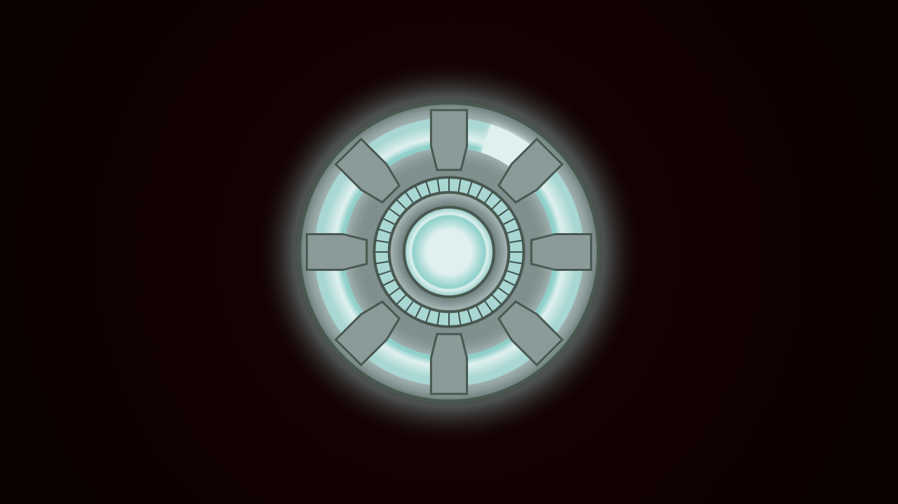

# Arc Reactor Canvas

A canvas-based animation of Iron Man's Arc Reactor built with HTML5 Canvas and JavaScript.

## Demo



The full animation can be viewed in the [video recording](artifacts/video.webm).

## Getting Started

Simply open `index.html` in a web browser to view the animation.

## Testing

This project uses Playwright for automated testing and capturing screenshots/video of the animation.

### Setup

```bash
npm install
npx playwright install chromium
```

### Run Tests

```bash
npm test
```

### Generated Artifacts

After running tests, the following artifacts are captured in the `artifacts/` directory:

- `screenshot-initial.png` - Initial frame of the animation
- `screenshot-animation.png` - Mid-animation frame
- `screenshot-final.png` - Final frame of the animation
- `video.webm` - Video recording of the animation
